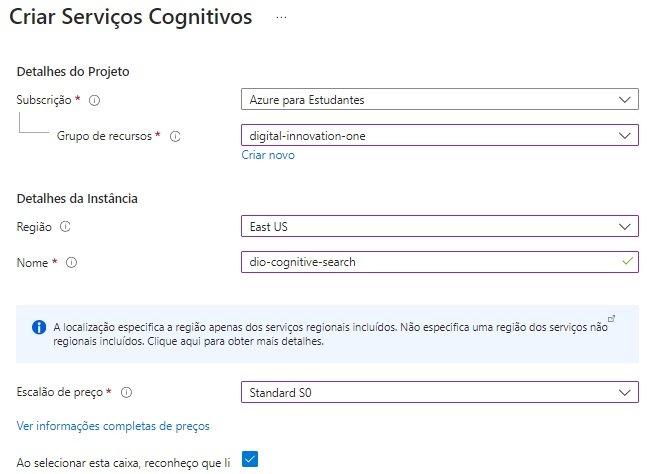
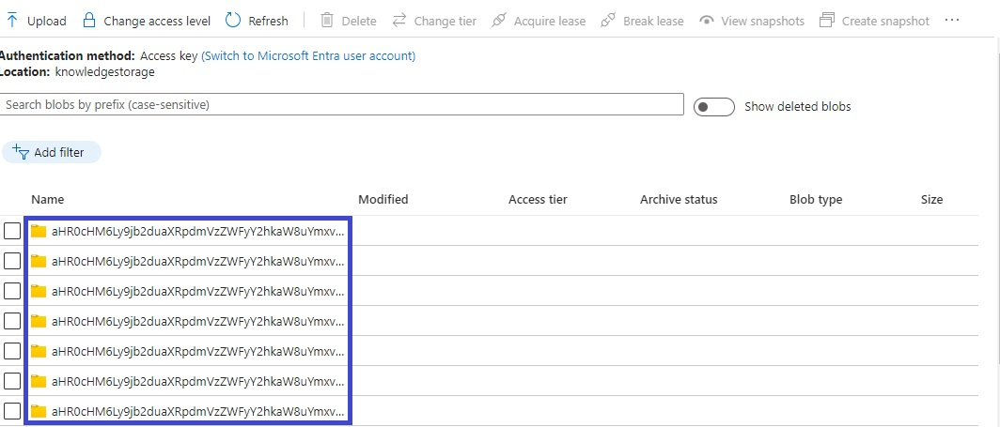

    
        
        <h1 style="margin: 0; text-shadow: 2px 2px 3px #888;">Microsoft Azure AI Fundamentals</h1>
    

 

    <h2 style="margin: 0; text-shadow: 2px 2px 3px #888; font-family: 'Helvetica', sans-serif; text-decoration: none;">
Laboratório: Explorando um índice do Azure AI Search (UI)</h2>

    

    

               <h4 style="margin: 0; text-shadow: 2px 2px 3px #888; font-family: 'Raleway', sans-serif;">I ❤️ Front-End Development!</h4>
    

<h3>Encontre-me :handshake: </h3> 

    
    
    
</a>
    
    
    

 

---

### Menu
- [Introdução :pushpin:](#introdução-pushpin)
- [Objetivo](#objetivo)
- [Insights e Aprendizados :performing\_arts:](#insights-e-aprendizados-performing_arts)
- [Possibilidades de Ferramentas Complementares](#possibilidades-de-ferramentas-complementares)
- [Instruções :gear:](#instruções-gear)
- [Criar Recursos do Azure](#criar-recursos-do-azure)
- [Extrair e Carregar Dados](#extrair-e-carregar-dados)
- [Configurar Azure AI Search](#configurar-azure-ai-search)
- [Consultar o Índice](#consultar-o-índice)
- [Revisar o Armazenamento de Conhecimento](#revisar-o-armazenamento-de-conhecimento)
- [Recursos Necessários](#recursos-necessários)
- [Licença :traffic\_light:](#licença-traffic_light)
- [Agradecimentos :tada:](#agradecimentos-tada)

## Introdução :pushpin:   

Bem-vindo ao laboratório: Explorando um índice do Azure AI Search (UI)!

Este guia abrangente oferece um passo a passo detalhado para a configuração de uma solução de pesquisa, destacando a utilização do Azure AI Search. Nosso foco principal está na mineração de conhecimento a partir das valiosas avaliações dos clientes da Fourth Coffee.

A busca por insights significativos nas experiências dos clientes tornou-se uma prioridade essencial para empresas inovadoras, e a Fourth Coffee não é exceção. Este guia visa facilitar o processo de configuração de uma solução de pesquisa robusta, utilizando a poderosa plataforma Azure AI Search.

## Objetivo

**_Mineração de Conhecimento:_**

O principal objetivo é extrair conhecimento das avaliações de clientes, consumidores, usuários permitindo compreender melhor as necessidades, sentimentos e expectativas dos em cada nicho. 

**_Avaliações de Clientes:_**

Centraremos nossa atenção nas avaliações específicas dos clientes da Fourth Coffee, utilizando o Azure AI Search para criar um índice inteligente capaz de oferecer insights precisos e relevantes.
Ao seguir este guia passo a passo, você será orientado desde a criação de recursos no Azure até a consulta do índice de pesquisa, explorando os dados enriquecidos e os aprendizados adquiridos ao longo do processo.

## Insights e Aprendizados :performing_arts:

Durante o processo de configuração da pesquisa com Azure AI Search, alguns insights valiosos e aprendizados foram adquiridos:

1. **Facilidade de Configuração:**

A plataforma Azure AI Search proporcionou uma configuração intuitiva e eficiente, simplificando a criação de índices e indexadores.

2. **Integração com Serviços de IA:**

A integração fluida com serviços de IA do Azure permitiu enriquecer os dados com insights gerados por IA, como extração de frases-chave, detecção de sentimentos e habilidades cognitivas em imagens.

3. **Armazenamento de Conhecimento:**

O armazenamento de conhecimento revelou-se poderoso, proporcionando acesso a dados enriquecidos por meio de projeções, tabelas e documentos, facilitando a análise aprofundada.

4. **Personalização da Pesquisa:**

A flexibilidade na configuração do índice permitiu personalizar a pesquisa para atender a requisitos específicos, como filtragem por localização e sentimento.

## Possibilidades de Ferramentas Complementares

1. **Power BI:**

Integre Azure AI Search ao Power BI para criar dashboards interativos e visualizações dinâmicas com base nos dados da pesquisa.

2. **Azure Logic Apps:**

Automatize fluxos de trabalho conectando Azure AI Search a Azure Logic Apps, proporcionando respostas automáticas a consultas específicas.

3. **Azure Cognitive Services:**

Explore outras habilidades do Azure Cognitive Services, como reconhecimento de entidades, para enriquecer ainda mais os dados e fornecer insights detalhados.

4. **Elasticsearch:**

Considere a integração com Elasticsearch para ampliar as capacidades de pesquisa e análise, especialmente em ambientes mais complexos.

5. **Azure DevOps:**

Utilize Azure DevOps para implementação contínua e aprimoramento contínuo da solução de pesquisa, garantindo eficiência e atualizações rápidas.

**Conclusão:**

Estes insights, aprendizados e possibilidades de ferramentas adicionais podem enriquecer ainda mais a solução de pesquisa, proporcionando uma base sólida para a mineração de conhecimento na Fourth Coffee. 

Embora tenha considerado um bootcamp com pouco conteúdo, conseguir agregar conhecimento baseado em outras tantas experiencias na plataforma da Digital Innovation One e também na faculdade.

...

## Instruções :gear:

O objetivo deste projeto é criar uma solução de mineração de conhecimento utilizando o Azure AI Search, com foco nas avaliações de diversos cenários. Esta iniciativa busca extrair insights significativos das experiências dos consumidores, proporcionando uma compreensão mais profunda das necessidades e expectativas do público-alvo.

Este guia é um ponto de partida abrangente para a execução do projeto de     de conhecimento com Azure AI Search. Siga cada etapa cuidadosamente, aproveitando as oportunidades para personalizar e aprimorar a solução de acordo com as necessidades específicas de clientes, consumidores e usuários em diversos cenários. 

## Criar Recursos do Azure 
  
- Azure AI Search:**

    - Acesse o <a href="https://portal.azure.com/#home">portal do Azure</a>.
    - Crie um recurso Azure AI Search com configurações específicas.

- **Serviços de IA do Azure:**

Você precisará provisionar um recurso de serviços de IA do Azure que esteja na mesma região que o seu recurso do Azure AI Search. Sua solução de pesquisa utilizará esse recurso para enriquecer os dados no armazenamento com insights gerados por IA.

Na página inicial do portal do Azure. Clique no botão ＋Criar um recurso e pesquise os serviços de IA do Azure. Selecione criar um plano de serviços de IA do Azure. Isso o direcionará para uma página onde você pode configurar o recurso de serviços de IA do Azure com as seguintes configurações:

- **Conta de Armazenamento:**

    - Crie uma conta de armazenamento com contêineres de blobs.

    - Procure conta de armazenamento e crie um recurso de conta de armazenamento com as seguintes configurações:

## Extrair e Carregar Dados

- Baixe e extraia as avaliações de café para uma pasta.
- Crie um contêiner chamado "coffeereviews" na conta de armazenamento.
- Faça o upload dos documentos de avaliações para o contêiner.

## Configurar Azure AI Search

- No portal do Azure, acesse o recurso Azure AI Search.
- Importe dados do armazenamento Blob usando o assistente de - importação de dados.
- Configure a fonte de dados, habilidades cognitivas e enriquecimentos.
- Crie um índice, indexador e configure o armazenamento de - conhecimento.

## Consultar o Índice

- Use o Search Explorer para testar consultas.
- Consulte todos os documentos usando search=*&$count=true.
- Refine a pesquisa por localização ou sentimento.

## Revisar o Armazenamento de Conhecimento

- Navegue até a conta de armazenamento.
- Explore os contêineres de armazenamento de conhecimento.
- Analise projeções, tabelas e dados enriquecidos.

## Recursos Necessários

**Azure AI Search:**

- Um recurso para gerenciar indexação e consulta.
  
**Serviços de IA do Azure:**

- Fornece habilidades de IA para enriquecer dados.

**Conta de Armazenamento:**

- Armazena documentos brutos e coleções.

...

---

## Licença :traffic_light:
Este projeto está licenciado sob a Licença consulte o arquivo 
 [MIT](https://opensource.org/licenses/MIT).

## Agradecimentos :tada:

_**Digital Innovation One**_ 

Agradeço à Digital Innovation One por proporcionar recursos educacionais valiosos que contribuíram para o desenvolvimento dos meus projetos.

 

_**Azure**_

Expresso minha gratidão à equipe do Microsoft Azure por oferecer uma plataforma robusta e escalável para hospedar e gerenciar aplicativos em nuvem. A eficiência e confiabilidade do Azure são fundamentais para o sucesso de muitos projetos.

_**VS Code**_

Agradeço à equipe do Visual Studio Code pelo incrível editor que facilita o desenvolvimento deste projeto.

_**Microsoft**_

Agradeço à equipe da Microsoft por suas contribuições inovadoras para o mundo da tecnologia. Sua dedicação ao desenvolvimento de software e serviços tem impactado positivamente a comunidade global de desenvolvedores.

_**GitHub**_ 

Agradeço à equipe do GitHub por fornecer uma plataforma de desenvolvimento colaborativo que facilita o compartilhamento de projetos.

Copyright © 2024 / RenatoMor

